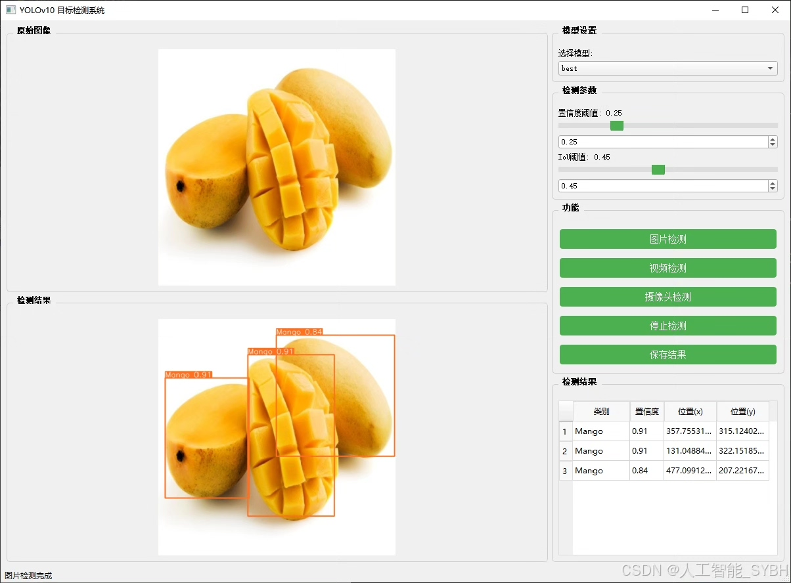
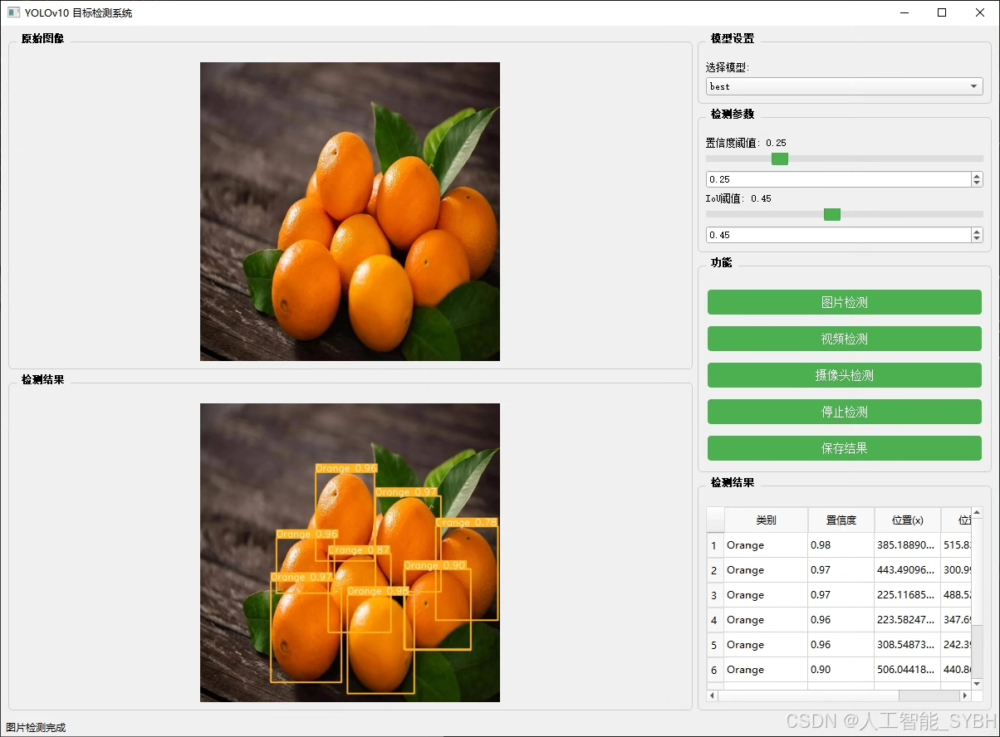
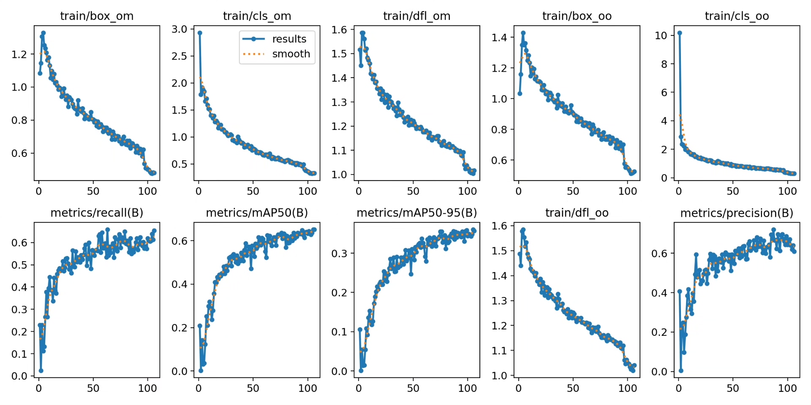
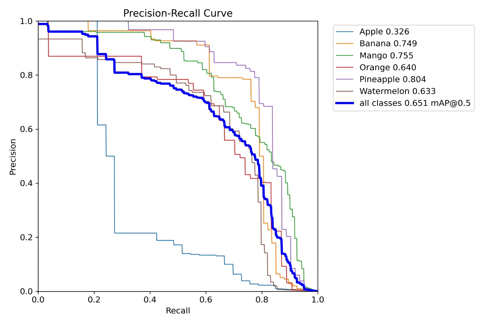
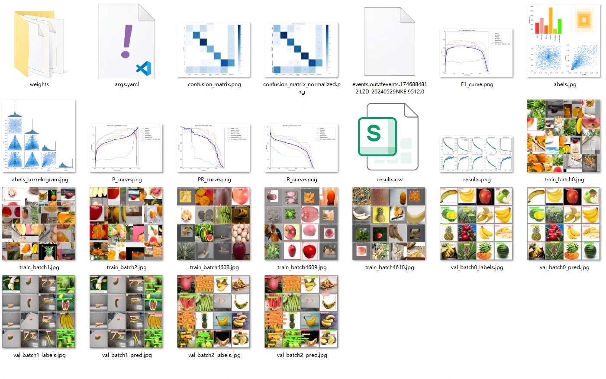
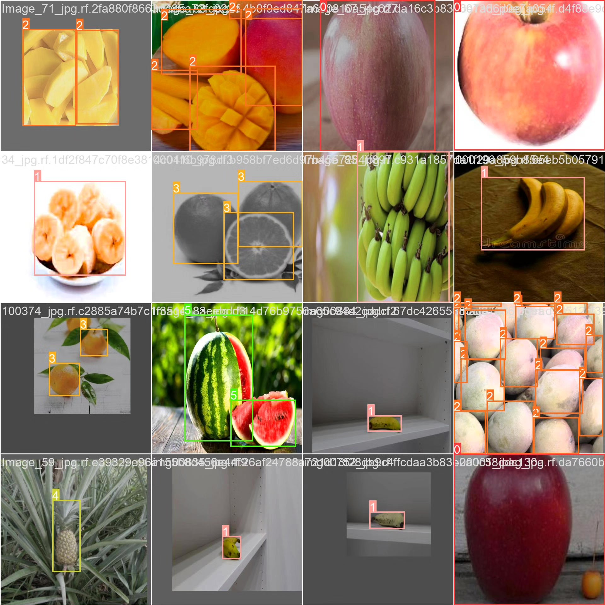
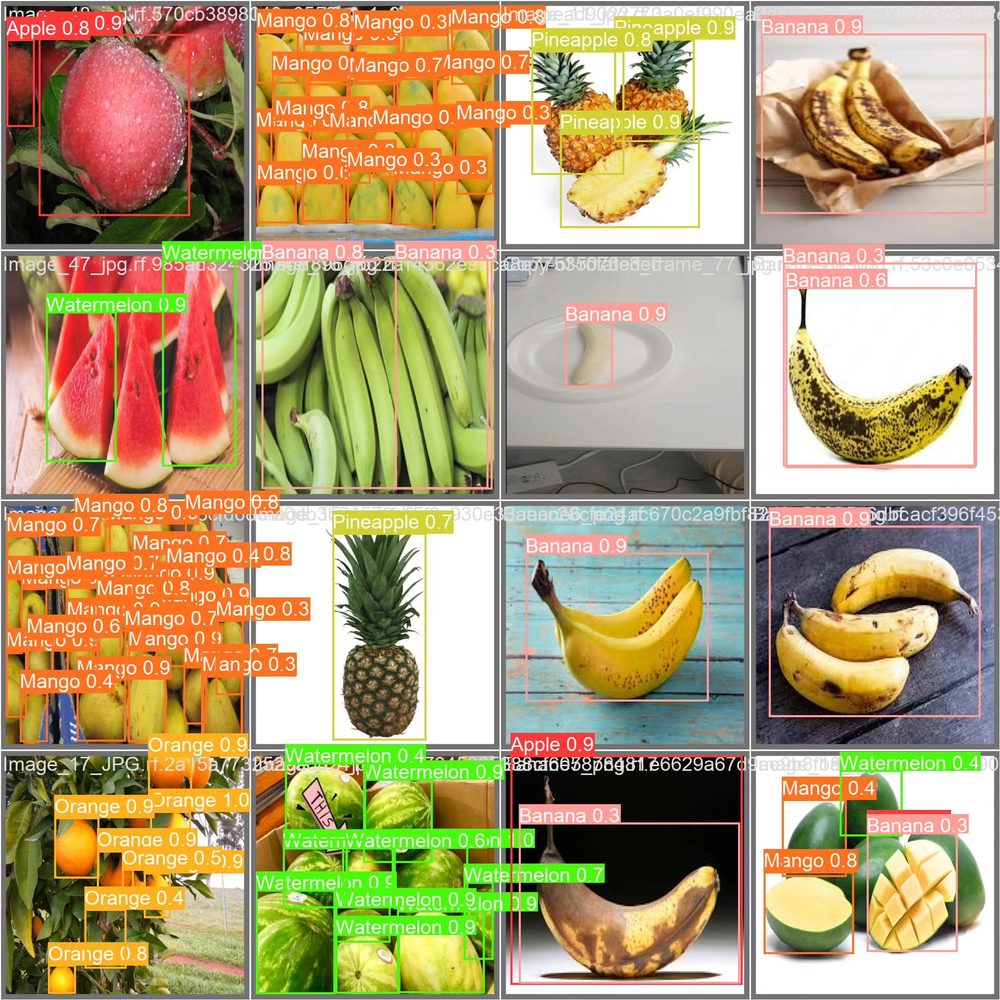
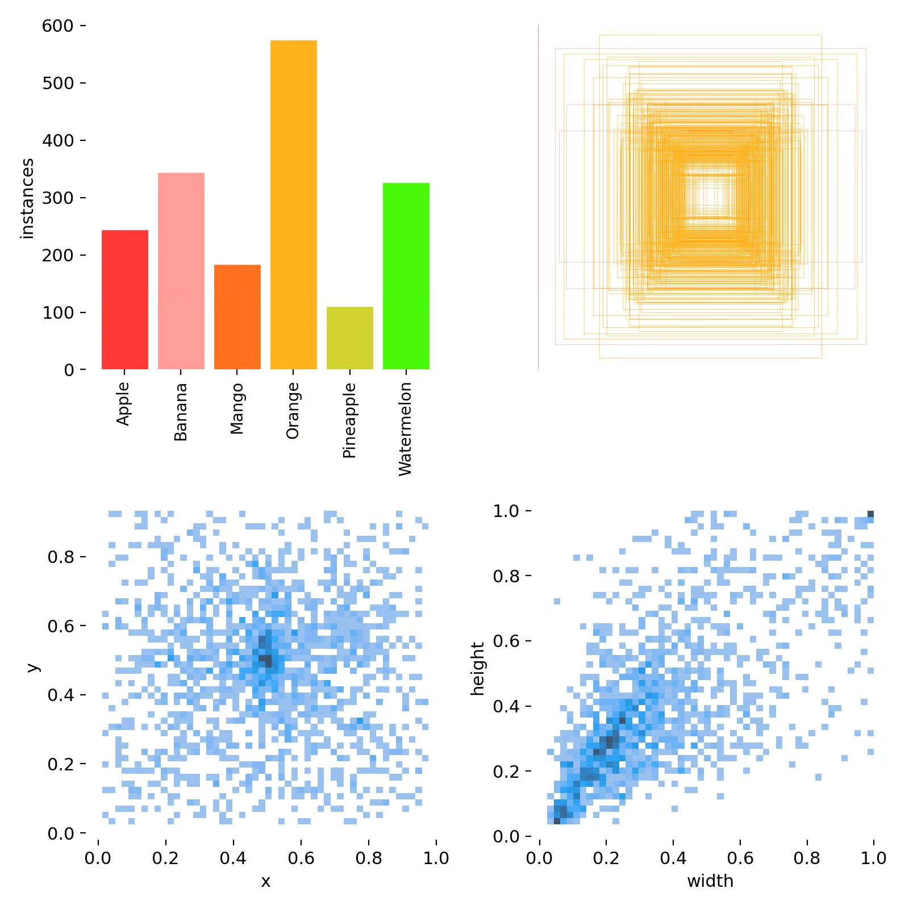

# Fruit classification detection system based on deep learning YOLOv10

## Body

Based on the YOLOv10 deep learning framework, this project has developed a high-precision fruit multi-target classification detection system. It can simultaneously recognize six common fruits: Apple, Banana, Mango, Orange, Pineapple, and Watermelon. The system can accurately identify the types of fruits and locate their positions through real-time analysis of fruit images. This provides an efficient solution for intelligent retail, automatic sorting, and agricultural harvesting scenarios. The project has constructed a dataset containing 1007 high-quality labeled images, including 768 training sets, 129 validation sets, and 110 test sets. The system has specially optimized its recognition ability for complex scenarios such as overlapping fruits, partial occlusion, and different maturity levels, significantly improving the accuracy and robustness of fruit detection.

The company's products have obtained the official commercial license certification from YOLO.

We provide after-sales service.

After payment, we will provide WeChat IDs to answer questions at any time.

Environment configuration: We will provide a tutorial on environment configuration, and WeChat will provide answers to questions.

Remote installation service: If you need remote configuration, an additional fee of 69 is required, with all fees refunded if the configuration fails (only refund installation fees for older computers).

Retraining the dataset: After configuring the environment, you can train on your own computer. If you need us to retrain, just pay 69 plus computing power fees (2.5 yuan/hour).

Full after-sales service

## Images

## Payment

Here is a pay link on Stripe ( https://buy.stripe.com/3cs8yP7sY87d0vu9AB ). Please contact me lonlonago@foxmail.com after funding $89, and I will send you a complete data files , thank you!

